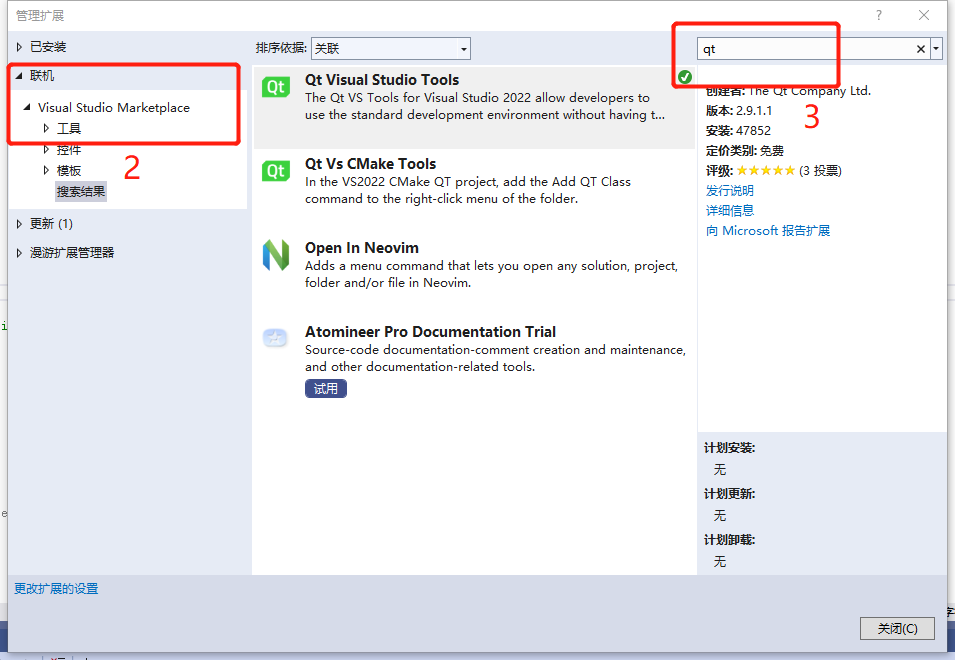
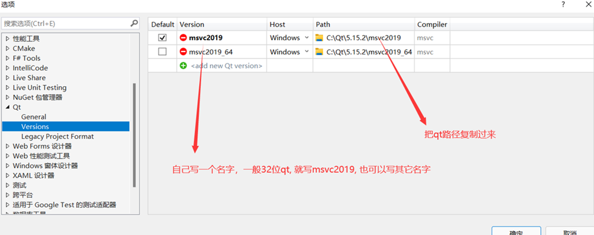

# M20 SDK development environment build on Windows platform

[TOC]

## System Environment

​	•	System：Windows10+

## Development Environment

​	•	Visual studio 2019+
​	•	QtCreator 5.12.4

## Driver 

​	•	CP210x_Windows_Win10_Drivers.zip

Software installation
	•	Install Visual studio，Visual studio 2019 is recommended
		o	Microsoft Visual studio official download address ：https://docs.microsoft.com/en-us/visualstudio/install/install-visual-studio?view=vs-2022
	•	Install QtCreator, it is recommended to install Qt5.12.4 
		o	Qt 5.12.4 official download address ： https://download.qt.io/archive/qt/5.12/5.12.4/qt-opensource-windows-x86-5.12.4.exe

## Download Visual studio 2019 and Qt 5.12.4

1、Download Visual studio 2019, just click the download directly on the official website, it is free.

2、Download qt, you can download it on the official website.

About vs and qt installation
•Install vs2019 to a custom directory, and select the required libraries (such as C++ and python libraries) according to personal needs
• Qt installation does not require many custom operations, just select msvc2017 or 2015, install to a custom directory and click Next until the installation is complete.

## Add QT to system environment variables

## Create new project and add qt plugin in vs2019

Click Extensions--Manage Extensions--Online--Search Qt--Download

After the download is complete,  close VS, and a prompt box will appear to confirm whether to modify the configuration. Select Modify, then restart VS, and click Extension—QT VS Tools—Qt Versions after restarting.

After clicking Qt Versions, select Qt-Versions in the options on the left, and then as shown in the figure below, fill in a custom name under Version, paste the download path of qt in Path, and then confirm.

Then you can create a QT project.

## Compile Sample Demo with QtCreator

1. Use QtCreator to open the project file MtcControlLibuvcCamera.pro

2. Compile the project until the program is compiled successfully

   

## Compile Sample Demo with VS + Qt

1. Use VS to open the project file MtcControlLibuvcCamera.sln

2. Compile the project until the program is compiled successfully

   

## Call the M20 SDK in different development languages

​	Head file

​	M20 static/dynamic link library

ffmpeg dynamic link library

ffmpeg static link library

## 		Call M20 SDK using VS C++ 

### 		Required development tools

​					 

### 		Steps

Use VS2019 to open the project Sample.sln

Project parameter configuration - additional include directory

Additional library directory

Additional dependencies

Pre-build event

Compile the project until the program is compiled successfully.

## Call M20 SDK using VS C#

### Required development tools

### Steps

1. Use VS2019 to open the project CSharpDemo.sln.
2. Project parameter configuration

3. Compile the project until the program is compiled successfully.

## Call M20 SDK using python

### Required development tools

​		python-3.9.7-amd64.exe
​		pycharm-community-2021.2.2.exe

### Steps

1. Open the project: use a text editor or pycharm to open the file Demo.py

2. Copy the file: Click the copyDLL.bat script file to copy the library file to the current directory
3. Compile and debug: Compile the project until the program is compiled successfully

   

# M20&M20s SDK development environment build on Linux platform 

## Development Environment

- System：Ubuntu，Ubuntu18 is recommended

## Software Environment

- QtCreator5.12.4

## Software installation

(1) Install Qt:

Step 1: go to the official website http://download.qt.io/archive/qt/ to download the Qt installation package, you can install qt-opensource-linux-x64-5.12.4.run;
Step 2: Open the terminal, enter the command: "sudo chmod -R 777 qtopensource-linux-x64-5.12.4.run", grant the installation package permission;
Step 3: Start installing Qt, enter the command "./qt-opensource-linux-x64-5.12.4.run" or "sudo ./qt-opensource-linux-x64-5.12.4.run", the difference of the two commands is that the former one is to install Qt in the home directory by default, and the latter is to install Qt in the root directory /opt. Of course, you can also set the installation path yourself during the GUI installation process, but it is recommended not to;
Step 4: According to the pop-up window, follow the prompts, keep clicking next, then skip, and then keep clicking next until this step, pay attention, as shown in the figure, mark all options with "√", click next, and then wait for installing;

(2) Configure the Qt environment:

Step 1: After the Qt installation is complete, do not open it, because other tools and library files need to be installed.
Step 2: Open the terminal, type the command "sudo apt-get install gcc g++" to install the compiler under linux;
Step 3: Enter the command "sudo apt-get install libqt4-dev" , otherwise there will be an error "cannot find -lgl" when compiling;
Step 4: Enter the command "sudo apt-get install build-essential", which is a compilation tool that allows our program to know where the header files and library functions are located;
Step 5: Open Qt, that is, in the terminal, enter the command "cd /home/.../Qt5.12.4/Tools/QtCreator/bin/", that is, use the cd command to enter your Qt installation directory (the above command is for Qt Installed in the home directory, if Qt is installed in the root directory, use the command "cd /opt/Qt5.7.0/Tools/QtCreator/bin/" instead), and then use the command "./qtcreator" to open Qt;

## Run Sample Demo

1. Create a folder Workspace in the /home/pi directory:
        mkdir Workspace
2. Copy the development package senseengine_lib-release.tar.gz to the Workspace folder through the U disk
3. Unzip the development package:
        tar -zxvf Workspace/senseengine_lib-release.tar.gz
4. Use the cd command to go to the directory where the executable file is located:
        cd WorkSpace/senseengine_lib-release/releaseVersion/linux64_14
5. Execute the command:
        ls #View files and directories
        sudo ./run.sh #Run the Sample Demo executable

## Compile Sample Demo with QtCretor

1. After the software is installed successfully, the QtCretor icon will appear in the menu bar

2. Use QtCretor to open the project file MtcControlLibuvcCamera.pro

   

3. Modify the project file uvcCamera.pro, as shown below, and modify the content in the red box to DEFINES += LINUX64

   

4. Compile the project until the program is compiled successfully

## Compile Simple Sample Demo

1. Use the cd command to go to the following directory:

   cd xxx/senseengine_lib/sample/Linux/Demo

2. Compile the project until the program is compiled successfully:

​		chmod +x run.sh

​		./run.sh

Note： When Please select platform(0/1/2): appears, select 1.

# M20 SDK development environment build on Raspberry Pi 4B platform

## Build Raspberry Pi 4B System

1. Raspberry Pi 4B mirror download
Download link: http://downloads.raspberrypi.org/raspios_armhf/images/raspios_armhf-2021-05-28/2021-05-07-raspios-buster-armhf.zip
   Version information: Use the command uname -a to query the version information. The version information is as follows:

2. Download the Raspberry Pi Windows platform burning tool and install the software
    Download link: http://downloads.raspberrypi.org/imager/imager_1.7.exe
3. Connect the sd card (used to store the Raspberry Pi 4B mirror) to the Windows host
    Put the sd card into the sd card reader, and then insert the sd card reader into the windows host USB port
4. Burn the mirror to the sd card
    First run the Raspberry Pi Windows platform burning tool installed in step 2, then import the Raspberry Pi 4B mirror downloaded in step 1, and then click the burn button to burn the mirror;
    Pull out the sd card reader after the burning is completed, take out the sd card, and insert it into the Raspberry Pi development board;
5. Start the Raspberry Pi system
   1. Connect the Raspberry Pi development board and monitor via HDMI cable
   2. Connect the mouse and keyboard to the Raspberry Pi development board
   3. Connect the power supply of the Raspberry Pi development board and power it on. At this point, the startup of the Raspberry Pi system is completed.
   4. Connect to the network (you can connect to wifi or wired network), which is easy to download online resources or update sources
6. Getting to know the basic operation of Raspberrypi 4B
   #Query Raspberry Pi version information
   uname -a
   lsb_release -a
   #Reinstall vim editor
   sudo apt-get remove vim-common
   sudo apt-get install vim
   #update source
   sudo vim /etc/apt/sources.list
   #Replace the source address, for example, using the Tsinghua University update source in China can update the content of the file to the following content
   deb http://mirrors.tuna.tsinghua.edu.cn/raspbian/raspbian/ buster main non-free contrib
   deb-src http://mirrors.tuna.tsinghua.edu.cn/raspbian/raspbian/ buster main non-free contrib
   sudo vim /etc/apt/sources.list.d/raspi.list
   #Replace the source address, for example, using the Tsinghua University update source in China can update the content of the file to the following content
   deb http://mirrors.tuna.tsinghua.edu.cn/raspberrypi/ buster main ui
   Note: The update source can be /etc/apt/sources.list and /etc/apt/sources.list.d/raspi.list to back up the global commonly used Raspberry Pi update source link: https://www.raspbian. org/RaspbianMirrors #Sync update source sudo apt-get update #Update and upgrade to install software packages, this process takes a long time sudo apt-get upgrade #Install Chinese input method sudo apt-get install scim-pinyin

 

## Run Sample Demo

1. Create a folder Workspace in the /home/pi directory
   mkdir Workspace
2. Copy the development package senseengine_lib-release4B.tar.gz to the Workspace folder through the U disk
3. Unzip the development package
 tar -zxvf Workspace/senseengine_lib-release4B.tar.gz
4. Use the cd command to go to the directory where the executable file is located:
 cd WorkSpace/senseengine_lib-release4B/release/arm32_pi4
5. Execute the command
 ls #View files and directories
    sudo ./run.sh #Run the Sample Demo executable

## Install QtCretor

#Execute the command to install the QtCretor component

​    sudo apt-get install build-essential
​	sudo apt-get install qt5-default qtcreator

## Compile Sample Demo with QtCretor

1. After the software is installed successfully, the QtCretor icon will appear in the menu bar

2. Use QtCretor to open the project file MtcControlLibuvcCamera.pro

   

3. Modify the project file uvcCamera.pro, as shown below, and modify the content in the red box to DEFINES += RASPBERRY4B

   

4. Compile the project until the program is compiled successfully

## Compile Simple Sample Demo

1. Use the cd command to go to the following directory:

   cd xxx/senseengine_lib/sample/Linux/Demo

2. Compile the project until the program is compiled successfully:

​		chmod +x run.sh

​		./run.sh

Note： When Please select platform(0/1/2): appears, select 1.

## References and Links

​	Tsinghua University Open Source Software Mirror Station Raspbian mirror usage help: https://mirror.tuna.tsinghua.edu.cn/help/raspbian/

# M20 SDK development environment build on Tinker Board 2S platform

## Build Tinker Board 2S System

1. Tinker board 2s mirror download 

   Download link：http://downloads.raspberrypi.org/raspios_armhf/images/raspios_armhf-2021-05-28/2021-05-07-raspios-buster-armhf.zip

2. Download the Tinker board 2s burning tool and install the software

   Download link：http://downloads.raspberrypi.org/imager/imager_1.7.exe

3. Connect the sd card (used to store the Tink board 2S mirror) to the Windows host
   Put the sd card into the sd card reader, and then insert the sd card reader into the windows host USB port

4. Burn the mirror to the sd card

   First run the Tinker board 2s burning tool installed in step 2, then import the Tinker board 2s mirror downloaded in step 1, and then click the burn button to burn the mirror;

   Unplug the sd card reader until the burning is completed, take out the sd card, and insert it into the Tinker board 2s development board;

5. Start Tinker board 2s System

   1. Connect the Raspberry Pi Tinker board 2s and the monitor via HDMI cable

   2. Connect the mouse and keyboard to the Tinker board 2s development board

   3. Connect the power supply of the Tinker board 2s development board and power it on. At this point, the startup of the Tinker board 2s system is completed.

   4. Connect to the network (you can connect to wifi or wired network), which is easy to download online resources or update sources

6. Getting to know the basic operation of Tinker board 2s

   #Querying Raspberry Pi version information

   uname -a 

   lsb_release -a

   #Update source

   sudo vim /etc/apt/sources.list

   #Replace the source address, for example, using the Tsinghua University update source in China can update the content of the file to the following content:

   deb http://mirrors.aliyun.com/debian/ buster main contrib non-free
   deb-src http://mirrors.aliyun.com/debian/ buster main contrib non-free
   deb http://mirrors.aliyun.com/debian-security buster/updates main
   deb-src http://mirrors.aliyun.com/debian-security buster/updates main

   Note: To update the source, you can make a backup of /etc/apt/sources.list and /etc/apt/sources.list.d/raspi.list
   #Sync update source
   sudo apt-get update
   #Update and upgrade to install packages, this process takes a long time
   sudo apt-get upgrade

## Run Sample Demo

1. Create a folder Workspace in the /home/pi directory
   mkdir Workspace
2. Copy the development package senseengine_lib-release4B.tar.gz to the Workspace folder through the U disk
3. Unzip the development package
   tar -zxvf Workspace/senseengine_lib-release4B.tar.gz
4. Use the cd command to go to the directory where the executable file is located:
   cd WorkSpace/senseengine_lib-release/releaseVersion/aarch64_tk2s
5. Execute the command
   ls #View files and directories
    sudo ./run.sh #Run the Sample Demo executable

## Install QtCretor

​	##Execute the command to install the QtCretor component  

​    sudo apt-get install build-essential
​	sudo apt-get install qt5-default qtcreator

## Compile Sample Demo with QtCretor

1. After the software is installed successfully, the QtCretor icon will appear in the menu bar

2. Use QtCretor to open the project file MtcControlLibuvcCamera.pro

   

3. Modify the project file uvcCamera.pro, as shown below, and modify the content in the red box to DEFINES += TINKERBOARD2S

   

4. Compile the project until the program is compiled successfully

## Compile Simple Sample Demo

1. Use the cd command to go to the following directory:

   cd xxx/senseengine_lib/sample/Linux/Demo

2. Compile the project until the program is compiled successfully:

​		chmod +x run.sh

​		./run.sh

Note： When Please select platform(0/1/2): appears, select 1.

