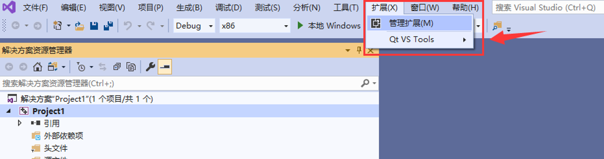

# Windows平台M20 SDK开发环境搭建

[TOC]

## 开发环境

​	•	系统版本：Windows10及以上

## 软件环境

​	•	Visual studio 2019+
​	•	QtCreator 5.12.4

## 模组驱动程序 

​	•	CP210x_Windows_Win10_Drivers.zip

软件安装
	•	安装Visual studio，推荐安装Visual studio 2019 
		o	微软Visual studio官方下载地址 ：https://docs.microsoft.com/en-us/visualstudio/install/install-visual-studio?view=vs-2022
	•	安装QtCreator，推荐安装Qt5.12.4 
		o	Qt5.12.4官方下载地址 ： https://download.qt.io/archive/qt/5.12/5.12.4/qt-opensource-windows-x86-5.12.4.exe
注:
	•	国内Visual studio 2019安装教程链接 ：https://blog.csdn.net/qq_36998053/article/details/105458416
	•	国内Qt5.12.4安装教程链接 ：https://blog.51cto.com/dlican/3741009
	•	国内vs+qt安装教程链接 ：https://blog.csdn.net/gaocui883/article/details/103965341
	•	VS2019以及MFC的安装详细教程 https://www.jb51.net/article/175149.htm

## 下载Visual studio 2019和Qt5.12.4

1、下载Visual studio 2019，直接在官网点击下载即可，是免费的。

2、下载qt，在官网站下载即可

关于vs和qt安装
	•	vs2019安装到自定义的目录即可，根据个人需求选择需要的库（如C++和python库）
	•	qt安装不需要许多自定义操作，选择msvc2017或者2015即可，安装到自定义的目录一直点击“下一步”直到安装完成。

## 将QT添加到系统环境变量中

## 在VS2019中创建新项目并添加QT插件

点击扩展--管理拓展--联机--搜索qt--下载

下载好后关闭VS，会出现是否确认修改配置的提示框，选择修改，然后重启VS，重启后点击扩展—QT VS Tools—Qt Versions

然后即可以创建qt项目。

## 使用QtCreator编译Sample Demo

1. 使用QtCreator打开工程文件MtcControlLibuvcCamera.pro

2. 编译调试工程，直到程序编译成功

   

## 使用VS+Qt编译Sample Demo

1. 使用VS打开工程文件MtcControlLibuvcCamera.sln

2. 编译调试工程，直到程序编译成功

   

## 不同开发语言调用M20 SDK

​	头文件

​	M20静/动态链接库

ffmpeg动态链接库

ffmpeg静态链接库

## 使用VS C++调用M20 SDK

### 		需要的开发工具

​					 

### 		使用步骤

​			使用VS2019打开工程Sample.sln

​		工程参数配置
​				附加包含目录

​				附加库目录

​				附加依赖项

​				生成前事件

​			编译调试工程，直到程序编译成功

## 使用VS C#调用M20 SDK

### 需要的开发工具

### 使用步骤

1. 打开工程：使用VS2019打开工程CSharpDemo.sln
2. 工程参数配置

3. 编译调试工程，直到程序编译成功

## 使用python调用M20 SDK

### 需要的开发工具

​		python-3.9.7-amd64.exe
​		pycharm-community-2021.2.2.exe

### 使用步骤

1. 打开工程：使用文本编辑器或者pycharm打开文件Demo.py

2. 拷贝文件：点击copyDLL.bat脚本文件，将库文件拷贝到当前目录

3. 编译调试：编译调试工程，直到程序编译成功

   

# Linux平台M20&M20s SDK开发环境搭建

## 开发环境

- 操作系统：Ubuntu，推荐使用Ubuntu18

## 软件环境

- QtCreator5.12.4

## 软件安装

(1)安装 Qt：

第一步：到官网http://download.qt.io/archive/qt/下载 Qt 安装包，可以安装 qt-opensource-linux-x64-5.12.4.run；
第二步：打开终端，输入命令："sudo chmod -R 777 qtopensource-linux-x64-5.12.4.run",赋予安装包权限；
第三步：开始安装 Qt,输入命令"./qt-opensource-linux-x64-5.12.4.run"或者"sudo ./qt-opensource-linux-x64-5.12.4.run",两者的区别在于，前者是将 Qt 默认安装在 home 目录下，后者是将 Qt 安装在根目录／opt 下，当然你也可以在图形界面安装过程中自行设置安装路径，但是建议最好不要；
第四步：根据弹出的窗口，按照提示，一直点击 next，再点击 skip,之后一直点击 next，直到这一步，注意，如图，将所有选项打"√"，点击 next，即可，然后等待安装；

(2)配置 Qt 环境：

第一步：Qt 安装完成后，先别打开，因为还需要安装其他工具以及库文件。
第二步：打开终端，键入命令"sudo apt-get install gcc g++"，安装 linux 下编程的编译器；
第三步：再输入命令"sudo apt-get install libqt4-dev",不然编译时会出现错误"cannot find -lgl"；
第四步：再输入命令"sudo apt-get install build-essential"，这是一个编译工具，它可以使得我们的程序知道头文件和库函数放在哪个位置；
第五步：打开 Qt,即在终端，输入命令"cd /home/.../Qt5.12.4/Tools/QtCreator/bin/"，即，使用 cd 命令进入你的 Qt 安装目录（以上命令针对 Qt 安装在 home 目录下，如果Qt 安装在根目录下，则使用命令"cd /opt/Qt5.7.0/Tools/QtCreator/bin/"），然后使用命令"./qtcreator"打开 Qt；

注：国内ubuntu上装Qt5.12.4教程链接 ：https://blog.csdn.net/weixin_38621214/article/details/92764479

## 运行Sample Demo可执行程序

1. /home/pi目录下创建文件夹Workspace
        mkdir Workspace
2. 将开发包senseengine_lib-release.tar.gz通过U盘复制到Workspace文件夹下
3. 解压开发包
        tar -zxvf Workspace/senseengine_lib-release.tar.gz
4. 切换到可执行程序目录
        cd WorkSpace/senseengine_lib-release/releaseVersion/linux64_14
5. 执行命令
        ls #查看文件和目录
        sudo ./run.sh #运行Sample Demo可执行程序

## 使用QtCreator编译Sample Demo

1. 软件安装成功菜单栏会出现QtCretor图标

2. 使用QtCreator打开工程文件MtcControlLibuvcCamera.pro

   

3. 修改工程文件uvcCamera.pro，如下图所示，将红框位置的内容修改为DEFINES += LINUX64

   

4. 编译调试工程，直到程序编译成功

## 编译Simple Sample Demo

1. 切换到目录 

   cd xxx/senseengine_lib/sample/Linux/Demo

2. 编译调试工程，直到程序编译成功

​		chmod +x run.sh

​		./run.sh

注： 出现Please select platform(0/1/2): 时，选择1

# 树莓派4B平台M20 SDK开发环境搭建

## 搭建树莓派4B系统

1. 树莓派4B镜像下载 

   下载链接：http://downloads.raspberrypi.org/raspios_armhf/images/raspios_armhf-2021-05-28/2021-05-07-raspios-buster-armhf.zip

   版本信息 ：使用命令 uname -a 可查询版本信息，版本信息如下：

2. 树莓派windows平台烧录工具下载，并进行软件安装

   下载链接：http://downloads.raspberrypi.org/imager/imager_1.7.exe

3. sd卡（用于存放树莓派4B镜像）连接到windows主机

   将sd卡放入sd读卡器中,再将sd读卡器插入到windows主机USB端口

4. 烧录镜像到sd卡

   首先运行步骤2安装好的树莓派windows平台烧录工具，再导入步骤1下载好的树莓派4B镜像,然后点击烧录按钮进行镜像烧录；

   直到烧录完成后拔出sd读卡器，取出sd卡，插入到树莓派开发板上；

5. 启动树莓派系统

   1.通过HDMI线连接树莓派开发板和显示器

   2.树莓派开发板上连接好鼠标和键盘

   3.连接树莓派开发板电源并上电，到此完成树莓派系统的启动工作

   4.连接网络（可连接wifi 或者 有线网络），便于下载网上资源或者更新源

6. 初识Raspberrypi 4B 基本操作

   #查询树莓派版本信息

   uname -a 

   lsb_release -a

   #重新安装vim编辑器

   sudo apt-get remove vim-common

   sudo apt-get install vim

   #更新源

   sudo vim /etc/apt/sources.list

   #更换源地址，例如国内使用清华大学更新源可以将文件内容更新为一下内容

   deb http://mirrors.tuna.tsinghua.edu.cn/raspbian/raspbian/ buster main non-free contrib

   deb-src http://mirrors.tuna.tsinghua.edu.cn/raspbian/raspbian/ buster main non-free contrib

   sudo vim /etc/apt/sources.list.d/raspi.list

   #更换源地址，例如国内使用清华大学更新源可以将文件内容更新为一下内容

   deb http://mirrors.tuna.tsinghua.edu.cn/raspberrypi/ buster main ui

   注：更新源可以将/etc/apt/sources.list和/etc/apt/sources.list.d/raspi.list做一下备份      全球常用的树莓派更新源链接 ：https://www.raspbian.org/RaspbianMirrors    #同步更新源  sudo apt-get update  #更新升级以安装软件包，这个过程耗时较长  sudo apt-get upgrade    ＃安装中文输入法  sudo apt-get install scim-pinyin

 

## 运行Sample Demo可执行程序

1. /home/pi目录下创建文件夹Workspace

​        mkdir Workspace

2. 将开发包senseengine_lib-release4B.tar.gz通过U盘复制到Workspace文件夹下

3. 解压开发包

​        tar -zxvf Workspace/senseengine_lib-release4B.tar.gz

4. 切换到可执行程序目录

​         cd WorkSpace/senseengine_lib-release4B/release/arm32_pi4

5. 执行命令

​         ls #查看文件和目录

​         sudo ./run.sh #运行Sample Demo可执行程序

## 安装QtCretor

​	#执行命令安装QtCretor组件  

​    sudo apt-get install build-essential
​	sudo apt-get install qt5-default qtcreator

## 使用QtCretor编译Sample Demo

1. 软件安装成功菜单栏会出现QtCretor图标

2. 使用QtCretor打开工程文件MtcControlLibuvcCamera.pro

   

3. 修改工程文件uvcCamera.pro 红框位置修改为DEFINES += RASPBERRY4B

   

4. 编译调试工程，直到程序编译成功

## 编译Simple Sample Demo

1. 切换到目录 

   cd xxx/senseengine_lib/sample/Linux/Demo

2. 编译调试工程，直到程序编译成功

​		chmod +x run.sh

​		./run.sh

注： Please select     platform(0/1/2): 选择0

## 参考资料及链接

​	清华大学开源软件镜像站 Raspbian 镜像使用帮助：https://mirror.tuna.tsinghua.edu.cn/help/raspbian/

# Tinker Board 2S平台M20 SDK开发环境搭建

## 搭建Tinker Board 2S系统

1. Tinker board 2s镜像下载 

   下载链接：http://downloads.raspberrypi.org/raspios_armhf/images/raspios_armhf-2021-05-28/2021-05-07-raspios-buster-armhf.zip

2. Tinker board 2s烧录工具下载，并进行软件安装

   下载链接：http://downloads.raspberrypi.org/imager/imager_1.7.exe

3. sd卡（用于存放Tinker board 2s镜像）连接到windows主机

   将sd卡放入sd读卡器中,再将sd读卡器插入到windows主机USB端口

4. 烧录镜像到sd卡

   首先运行步骤2安装好的Tinker board 2s烧录工具，再导入步骤1下载好的Tinker board 2s 镜像,然后点击烧录按钮进行镜像烧录；

   直到烧录完成后拔出sd读卡器，取出sd卡，插入到Tinker board 2s开发板上；

5. 启动Tinker board 2s系统

   1.通过HDMI线连接树莓派Tinker board 2s和显示器

   2.Tinker board 2s开发板上连接好鼠标和键盘

   3.连接Tinker board 2s开发板电源并上电，到此完成Tinker board 2s系统的启动工作

   4.连接网络（可连接wifi 或者 有线网络），便于下载网上资源或者更新源

6. 初识Tinker board 2s 基本操作

   #查询树莓派版本信息

   uname -a 

   lsb_release -a

   #更新源

   sudo vim /etc/apt/sources.list

   #更换源地址，例如国内使用清华大学更新源可以将文件内容更新为以下内容：

   deb http://mirrors.aliyun.com/debian/ buster main contrib non-free
   deb-src http://mirrors.aliyun.com/debian/ buster main contrib non-free
   deb http://mirrors.aliyun.com/debian-security  buster/updates main
   deb-src http://mirrors.aliyun.com/debian-security  buster/updates main

   注：更新源可以将/etc/apt/sources.list和/etc/apt/sources.list.d/raspi.list做一下备份      
   #同步更新源  
   sudo apt-get update  	
   #更新升级以安装软件包，这个过程耗时较长  
   sudo apt-get upgrade   

## 运行Sample Demo可执行程序

1. /home/pi目录下创建文件夹Workspace

​		mkdir Workspace

2. 将开发包senseengine_lib-release.tar.gz通过U盘复制到Workspace文件夹下

3. 解压开发包

​		tar -zxvf Workspace/senseengine_lib-release.tar.gz

4. 切换到可执行程序目录

​		cd WorkSpace/senseengine_lib-release/releaseVersion/aarch64_tk2s

5. 执行命令

​		ls #查看文件和目录

​		sudo ./run.sh #运行Sample Demo可执行程序

## 安装QtCretor

​	#执行命令安装QtCretor组件  
​	sudo apt-get install build-essential
​	sudo apt-get install qt5-default qtcreator

## 使用QtCretor编译Sample Demo

1. 软件安装成功菜单栏会出现QtCretor图标

2. 使用QtCretor打开工程文件MtcControlLibuvcCamera.pro

   

3. 修改工程文件uvcCamera.pro 红框位置修改为DEFINES += TINKERBOARD2S

   

4. 编译调试工程，直到程序编译成功

## 编译Simple Sample Demo

1. 切换到目录 

   cd xxx/senseengine_lib/sample/Linux/Demo

2. 编译调试工程，直到程序编译成功

​		chmod +x run.sh

​		./run.sh

注： Please select     platform(0/1/2): 选择2

